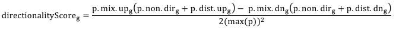

Reference manual
================================

*Kiwi* consists of a single user-accessible module. Here, the module details are outlined.

Arguments
----------------

The minimum syntax of the *Kiwi* command is: ::

	> import kiwi
	> kiwi.plot(gsn='path/to/geneset-geneset-interaction.txt', gss='path/to/geneset-analysis-results.txt')

There are a number of arguments that can be passed to the command.

Input
^^^^^
Examples of input files can be found in the subfolder kiwi/demo.

* gsn [*required*]:
	The geneset-geneset interaction file path. It is a 2 column table where each row contains two interacting genesets, each one per column, with no header.
* gss [*required*]:
	The geneset statistics result file path. It is, in its minimum implementation, a 2 or more column table where each row must contain as first column the genesets and in any column a statistics value for its significance. The header must identify the first column as *Name* and the geneset statistics column as *p-value*.
	If -ad is set to True, adjusted p-value are expected to be found in a column identified by the header as *p-adj*.
	Alternatively, a full geneset result file generated using `piano <http://www.sysbio.se/piano/>`_ can be supplemented. If generated using the function *writeFilesForKiwi.R* in piano, the file is parsed automatically.
* gsc [default = ""]:
	The geneset collection (geneset-gene) file	path. It is a two column table with genesets - genes associations in each row and no header.
* gls [default = ""]:
	The gene-level statistics file path. It is a three column table with gene - p-value - fold-change in each row. The genes must be as first column, while *p* values and fold-changes must be identified in the headers as *p-value* and *FC*.

Network analysis parameters
^^^^^^^^^^^^^^^^^^^^^^^^^^^
* pc [default =  0.01]: 
	This flag controls the maximum threshold for the significance of a geneset, after which it is discarded from the results. This removal will not affect shortest path length calculations.
* adj [default =  True]: 
	This flag controls if p-values adjusted for multiple testing should be used.
* gsz [default = 10**6] : 
	This flag control the maximum number of genes for a geneset after which it is discarded from the results. It can be used to exclude high gene count genesets, whose interpretability would be difficult and possibly messy to display in the heatmap. This removal will not affect shortest path length calculations.
* deg [default = 10**6] : 
	This flag controls the maximum degree of a geneset in the interaction network after which it is discarded from the results. It can be used to exclude very connected genesets (like ATP in a metabolic network) from the plots. This removal will not affect shortest path length calculations.
* spl [default = 2]: 
	This flag controls the maximum shortest path length between two genesets in the interaction network after which no edge would connect them. This can be interpreted as the threshold after which two genesets are considered unrelated.
* sae [default = False]: 
    Show all edges. This flag controls if all but the best edges (defined by having the shortest path length) for each node should be removed before plotting. If set to True, all edges (passing the spl cutoff) will be drawn. If set to False, only the best edges for each node will be included. 	
* lmp [default = False]:
	Lump genesets that share an identical gene list. This flag controls if only one geneset (randomly chosen) among all genesets that share an identical list of genes should be kept in the geneset-geneset interaction network. If set to True, all but one geneset among those that share an identical gene lsit will be removed from the interaction network. In the plot, a geneset that lumps other genesets shows a label that describes the number of lumped genesets after a star ("*"). If set to False, all genesets are treated as independent entities in the network even if they share an identical gene list.
	
Plotting parameters
^^^^^^^^^^^^^^^^^^^
* nsz [default = 300] : 
	This flag defines the node size of genesets with the highest *p* value to be plotted (in the extreme scenario, this equals pCutoff).
* eds [default = 5] : 
	This flag control the scaling of edge widths with one increment in the shortest path length between two connected genesets.
* lbs [default = 9] : 
	This flag sets the label sizes in the plots.
* hmt [default = "binary"] :
	This flag sets the color of the entries in the heatmap to black or white when set to "binary" or to a blue-to-red colormap according to the fold-change when set to "values".
* cft [default = ""] : 
	This flag reports the annotation source for the genes in the GSA run (e.g. Ensembl). It should match the annotation sources listed in `mygene.info <http://mygene.info>`_ (e.g. *ensembl.gene*).
* ctt [default = ""] : 
	This flag reports the annotation desired to plot the gene names in the heatmap (e.g. HUGO). It should match the annotation sources listed in `mygene.info <http://mygene.info>`_ (e.g. *symbol*).
* csp [default = ""] : 
	This flag reports the species for the gene annotation (e.g. Homo sapiens). It should match the species listed in `mygene.info <http://mygene.info>`_ (e.g. *human*).

Export options
^^^^^^^^^^^^^^
* nwf [default = ""] :
	This flag defines the name of the file where the network plot is saved (as PDF). If empty, it displays in the current device.
* hmf [default = ""] :
	This flag defines the name of the file where the heatmap is saved (as PDF). If empty, it displays in the current device.
* gml [default = ""] :
	This flag defines the name of the file where the graph shown in the network plot is saved (as GraphML).

Implementation
--------------
There are a number of calculations in *Kiwi* that are not directly accessible to users, like
the node color scale in the network plot when GSA results are generated using `piano <http://www.sysbio.se/piano/>`_.

Node color scale
^^^^^^^^^^^^^^^^
If genesets have no directionality, then the color scales directly with the -log10 p-value of the geneset.

If genesets have directionality, as implemented in `piano <http://www.sysbio.se/piano/>`_\, then if plotted using *Kiwi* the node *g* is color coded according to this formula:

where *p*.mix/dist.up/dn and *p*.non.dir refer to the log10-transformed geneset *p*-values for 
geneset *g* in the different directionality classes in piano, while max(*p*) is the maximum log10-
transformed *p*-value in the dataset. Note that the node directionality score will not change 
by varying any of the parameters: these *p*-values depend only on the input GSS file and not on 
the parameters (except "adj", that essentially implies the use of different geneset statistics).
Therefore, the directionality scores are comparable across different runs.

Using the formula above, the color gets more intense when (i) a geneset is significant (*non.dir*) 
and most significant genes are up(/down)-regulated (*p.mix.up(/dn)*) or when (ii) the up(/down)-
regulated genes dominate in term of significance with respect to the down(/up)-regulated ones
(*p.dir.up(/dn)*) and they are significant (*p.mix.up(/dn)*). The score is normalized between -1
and +1, where these value are assigned to the potentially most extreme scenario in the dataset.
For example, a score equal to 1 represents the case in which a geneset has the minimum possible *p*-value 
in the dataset in all the up classes (plus the non-directional) but the maximum *p*-value 
in all the down classes. Hence, the directionality score is comparable across experiments,
in that it is possible to evaluate how close a geneset is to the extreme scenario enabled by 
the experiment.

.. note:: 
	The network plot assigns the highest tonality (in each direction) to the node that has 
	the highest absolute directionality	score, regardless of the fact that the score is bounded
	between -1 and 1.
.. note:: 
	Consequential to the note above, if there is a node that is closer than any other to the
	extreme scenario (>1 order of magnitude), then all of other nodes will appear greyish. Try
	to export the network and tweak the colormap in Cytoscape or reduce the number of nodes in 
	the network plot.
	
Graph properties
^^^^^^^^^^^^^^^^
The graph plotted by *Kiwi* can be exported in graphML format and imported in `Cytoscape <http://www.cytoscape.org/>`_.
The following graph properties are saved in the process:

#. *shortest_path_length* (edge property): a numerical attribute for edges that reports the `shortest path length <http://en.wikipedia.org/wiki/Shortest_path_problem>`_ between the connected nodes in the geneset-geneset network.
#. *weight* (edge property): a numerical attribute identical in essence to the *shortest path length* but scaled to 1/edgeScaleFactor.  
#. *directionalityScore* (node property): a numerical attribute for nodes that scales either with the geneset p-value or directionality (see section above). 
#. *-log10p* (node property): a numerical attribute corresponding to the geneset p-value (non-directional p-value if `piano <http://www.sysbio.se/piano/>`_ was used to generate GSA results).

.. image:: kiwi_logo.svg
	:width: 200
	:align: right