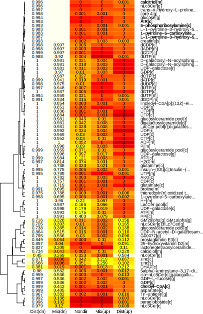
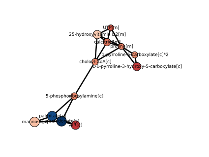
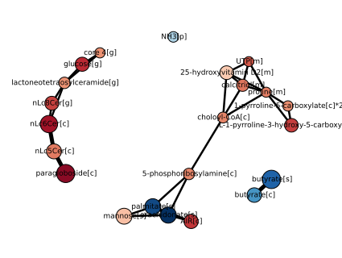
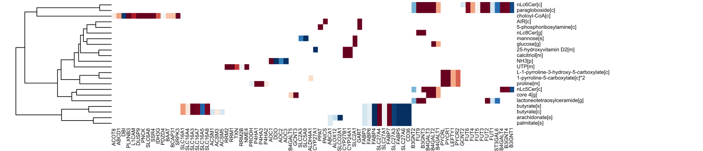

Tutorial
================================

Welcome to *Kiwi*! 

*Kiwi* is a visualization tool that combines geneset analysis (GSA) and a biological 
network that describes the interactions among genesets to provide an uncluttered view
of prominent genesets in a given condition and their relatedness. 

.. note:: 
	A *Kiwi* run is as easy as a single command-line call: ::
		
		> python -c "import kiwi; kiwi.plot(gsn='path/to/geneset-geneset-interaction.txt', gss='path/to/geneset-analysis-results.txt')"

In this tutorial, you re-analyze gene expression data for a lung adenocarcinoma vs. normal
adjacent tissue comparison from `Gatto et al. (2014) <http://www.pnas.org/content/111/9/E866>`_.

The goal - Why *Kiwi*?
------------------------

A limitation of geneset analysis (GSA) stands in the loss of information about the relatedness 
of genesets.

Often, genesets represent biological entities that talk to each other in interaction networks.
For example, when a metabolite is defined as a geneset, a typical GSA will output a list of
metabolites that are significant as genesets, i.e. most genes that encode for neighboring
reactions are differentially expressed in case vs. control. In our example scenario, a GSA run 
using `piano <http://www.sysbio.se/piano/>`_ produces the following (trimmed) figure:

	
However, metabolites are biologically connected entities by reactions. In the example above,
it may be hard to know that chondroitin and heparan sulfates, all of which are significantly
regulated in our case, are actually closely connected metabolites, unless you are an expert
of glycosaminoglycan biology. A *Kiwi* run of these GSA results will provide you this missing
piece of information:

	
Preparing the data
------------------
Input file requirements
^^^^^^^^^^^^^^^^^^^^^^^
To run *Kiwi*, the following data files are required:

#. A geneset-geneset interaction file (here on referred to as GSN file);
#. A geneset statistics result file (here on referred to as GSS file).

.. warning::
	If either the GSN or GSS files are missing or cannot be accessed, *Kiwi* will halt execution
	and produce an error.
	
For a full experience, the following files are also recommended:

#. A gene level statistics file (here on referred to as GLS file);
#. A gene-geneset file (here on referred to as GSC file);

If provided, the GLS file will output a heatmap that shows which genes contributed to the significance
of a geneset. 

Demo input files
^^^^^^^^^^^^^^^^
For our example, all input files can be found in the subfolder */demo*. If you do not have this
folder you can download the source from `Python Package Index (PyPI) <https://pypi.python.org/pypi/KiwiDist>`_, unpack it
and find the */demo* folder inside.

Input file format
^^^^^^^^^^^^^^^^^
Input files must be tab delimited text files.

* The GSN file is a 2 column table where each row contains two interacting genesets, each one per column, with no header. In our example, the GSN file looks like this: ::
	
	ethanol[c]	acetaldehyde[c]
	ethanol[c]	H+[c]
	ethanol[c]	NADH[c]
	
* The GSS file is, in its minimum implementation, a two or more column table where each row must contain as first column the genesets and in any column a statistics value for its significance.The header must identify the first column as *Name* and the geneset statistics column as *p-value*. It could be as simple as this: ::

	Name	p-value
	ethanol[c]	0.0001
	acetaldehyde[c]	0.8711
	H+[c]	0.2305
	NADH[c] 0.0024
	
* The GLS file is, in principle, the same you used to run GSA in the first place. It is a three column table with gene - *p*value - fold-change in each row. The genes must be as first column, while *p* values and fold-changes must be identified in the headers as *p-value* and *FC*, like this: ::

	Gene	p-value	FC
	ENSG00000000003	1.67109001147722e-48	-1
	ENSG00000000005	5.22386360495439e-18	-1
	ENSG00000000419	0.153340392968948	-1
	
* The GSC file is, in principle, the same you used to run GSA in the first place. It is a two column table with genesets - genes associations in each row and no header, like this: ::

	ethanol[c]	ENSG00000147576
	ethanol[c]	ENSG00000172955
	ethanol[c]	ENSG00000180011
	
.. note:: 
	*Kiwi* is optimized to work with results generated using `piano <http://www.sysbio.se/piano/>`_ .
	The GSS, GLS, and GSC files can be automatically generated within *piano* using the function 
	*writeFilesForKiwi.R*.

.. warning::
	In the current implementation, *Kiwi* is sensitive to the header content of GSS files.
	A wrong header will not produce errors while reading the GSS file, but it will most likely
	cause errors later in the code or generate meaningless results.

Running *Kiwi*
--------------

Once the files are ready, *Kiwi* can be run with a single command. Go to the Python interpreter and type: ::

	> import kiwi 
	> kiwi.plot(gsn='path/to/geneset-geneset-interaction.txt', gss='path/to/geneset-analysis-results.txt',
	            gls='path/to/gene-level-statistics.txt', gsc='path/to/gene-geneset.txt')
	
For our example, if your current directory is the module root folder, the call is: ::

	> kiwi.plot(gsn='demo/GSN.txt', gss='demo/GSS_LUAD.txt', gls='demo/GLS_LUAD.txt', gsc='demo/GSC_LUAD.txt')
	
The following figures are then displayed in your default device:

	
You are done! Now it is time for the interpretation of results.

Understanding the results
-------------------------
Genesets
^^^^^^^^
When a geneset is deemed significant, it means that the underlying process/function/entity 
is prominent for the case compared to control. In our example, 1-pyrroline-5-carboxylate is relevant
in lung adenocarcinoma compared to tumor-adjacent normal tissue. In those scenarios
where extensive regulation is taking place, like in a comparison tumor vs. normal, it is often the
case that many genes in a geneset are differentially expressed, yet a GSA run declares the
geneset not significant. In our example, a geneset on this line is glutamate-5-semialdehyde
(even if it lies just upstream of 1-pyrroline-5-carboxylate). This is due to the 
extensive background regulation in case vs. control: such genesets may happen to contain a lot
of regulated genes just by chance, and a GSA controls for this possibility by correcting the 
background distribution. The bottom-line is that the genesets shown by *Kiwi* in the network
plot are prominent for your case beyond chance (within a confidence interval of 95%, by default).

If a GLS file is provided, the heatmap shows all genes that contributed to the prominence
of each geneset in the network plot. This plot is useful mainly for two reasons:

* It shows the overlap between genesets, i.e. the genes shared by different genesets. Similar genesets cluster together.
* It shows the overlap between genes, i.e. genes that tend to co-express to yield prominence in a geneset.

In general, all these results should be easily interpreted by users familiar with GSA (and 
most of this information is available in GSA modules). 
	
Interactions
^^^^^^^^^^^^
The unicity of a network plot generated by *Kiwi* stands in the presence of interactions between
genesets. These are derived from the geneset-geneset interaction network file. An edge between
two genesets indicate that the two are somehow biologically related, and the strength of the
relatedness is represented by the edge width. 

This information enhances the interpretability of a typical GSA output. In our example, a 
geneset is a metabolite, and metabolites are interacting with each other via reactions, hence 
the emergence of metabolic networks. Two metabolites might be prominent as genesets due to 
strong regulation in very different genes, and yet be related due to vicinity in the metabolic 
network. The vicinity is measured in terms of shortest path length in the network between 
two metabolites, i.e. the number of reactions the two metabolites are apart. 

In our case vs. control study, 1-pyrroline-5-carboxylate and 5-phosphoribosylamine are prominent genesets
because of regulation of different genes, yet they couple proline and pirimidine biosynthesis 
(i.e. they are not distant in the metabolic network due to the intermediation of choloyl-CoA).

What next?
----------
If you are not satisfied with the presentation of the results (the plot can be cluttered
and messy in case of extensive geneset regulation) or the plots provide  either too much 
or too little information, *Kiwi* offers a number of options and settings that can be tweaked 
(e.g. the cutoff for the shortest path length or geneset). 
 
There are three ways you could top your experience with Kiwi:

#. Export the network in the plot as a GraphML file and import it in `Cytoscape <http://www.cytoscape.org/>`_. In Cytoscape, the network layout can be controlled in a more flexible way. Moreover, nodes and edges preserve their attributes (significance, directionality index, width, and shortest path length), that can be used in the VizMapper.
#. Read the :doc:`reference manual`. You will find more information on arguments and how plots are created.
#. Contribute! Kiwi is open source. You can read the :doc:`api`, or send your suggestions or bugs to the developers.

.. image:: kiwi_logo.svg
	:width: 200
	:align: right